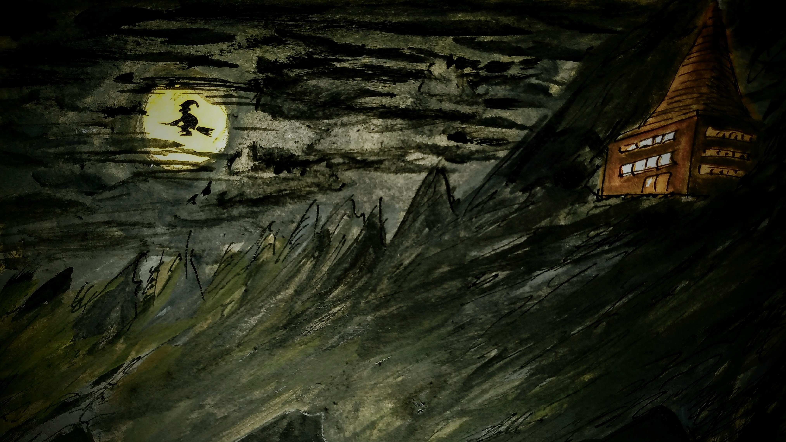

  

Experimentando com a paleta do [Anders Zorn](https://pt.wikipedia.org/wiki/Anders_Zorn "Anders Zorn na Wikipedia").

É engraçado como usando vermelho, amarelo, preto e branco aparecem tons de verde.

Provavelmente é porque esse preto da Caran D'Ache leva um pouco de azul.